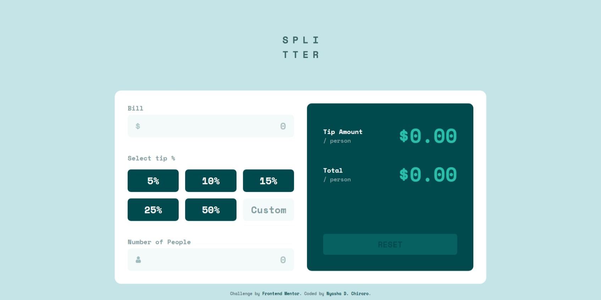

# Frontend Mentor - Tip calculator app solution

This is a solution to the [Tip calculator app challenge on Frontend Mentor](https://www.frontendmentor.io/challenges/tip-calculator-app-ugJNGbJUX). Frontend Mentor challenges help you improve your coding skills by building realistic projects.

## Table of contents

-   [Frontend Mentor - Tip calculator app solution](#frontend-mentor---tip-calculator-app-solution)
    -   [Table of contents](#table-of-contents)
    -   [Overview](#overview)
        -   [The challenge](#the-challenge)
        -   [Screenshot](#screenshot)
        -   [Links](#links)
    -   [My process](#my-process)
        -   [Built with](#built-with)
    -   [Author](#author)

## Overview

### The challenge

Users should be able to:

-   View the optimal layout for the app depending on their device's screen size
-   See hover states for all interactive elements on the page
-   Calculate the correct tip and total cost of the bill per person

### Screenshot

### Links

-   Solution URL: [https://www.frontendmentor.io/solutions/tip-calculator-app-using-html-tailwindcss-and-vite-ab42gUi4iT](https://www.frontendmentor.io/solutions/tip-calculator-app-using-html-tailwindcss-and-vite-ab42gUi4iT)
-   Live Site URL: [https://tip-calculator-ndc.netlify.app/](https://tip-calculator-ndc.netlify.app/)

## My process

### Built with

-   Semantic HTML5 markup
-   [TailwindCSS](https://tailwindcss.com/) - A utility-first CSS framework
-   Flexbox
-   CSS Grid
-   Mobile-first workflow
-   [Vite](https://vitejs.dev/) - Next gen frontend tooling

## Author

-   Frontend Mentor - [@chiroro-jr](https://www.frontendmentor.io/profile/chiroro-jr)
-   Twitter - [@chiroro_jr](https://www.twitter.com/chiroro_jr)
